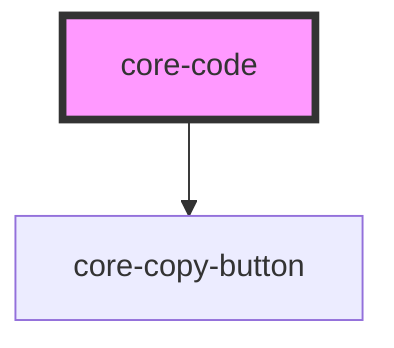

# my-component

<!-- Auto Generated Below -->

## Properties

| Property    | Attribute     | Description | Type      | Default |
| ----------- | ------------- | ----------- | --------- | ------- |
| `isOneLine` | `is-one-line` |             | `boolean` | `false` |

## Dependencies

### Depends on

- [core-copy-button](../core-copy-button)

### Graph

----------------------------------------------

*Built with [StencilJS](https://stenciljs.com/)*
