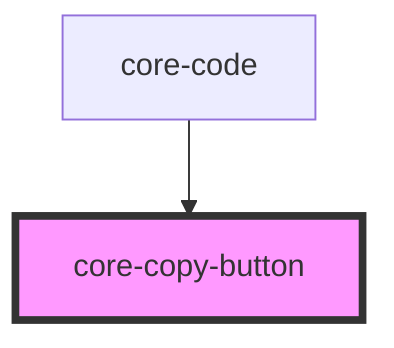

# my-component

<!-- Auto Generated Below -->

## Events

| Event         | Description | Type               |
| ------------- | ----------- | ------------------ |
| `copyClicked` |             | `CustomEvent<any>` |

## Methods

### `copy(valueToCopy: string) => Promise<void>`

#### Returns

Type: `Promise<void>`

## Dependencies

### Used by

 - [core-code](../core-code)

### Graph

----------------------------------------------

*Built with [StencilJS](https://stenciljs.com/)*
